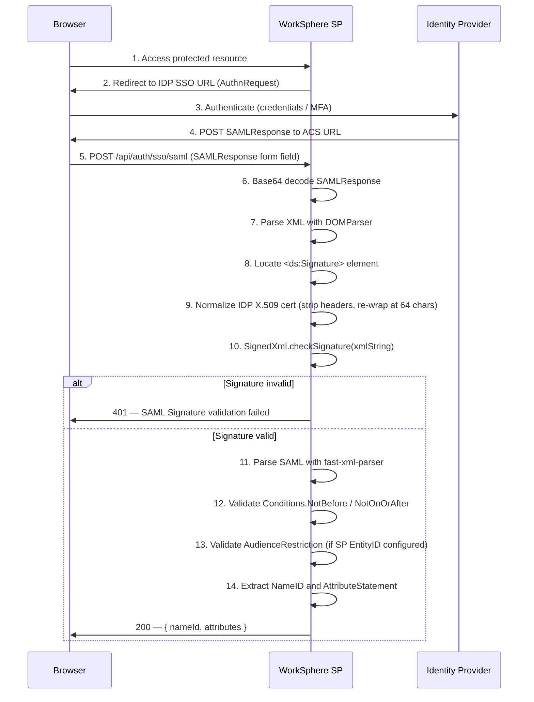
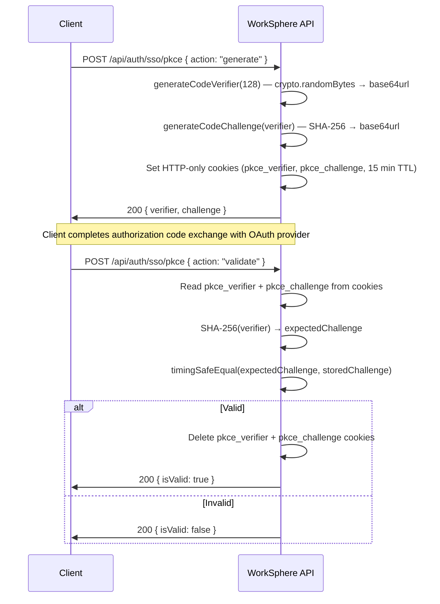

# Enterprise SSO — SAML 2.0 & PKCE Developer Guide

This guide documents the WorkSphere enterprise SSO integration for SAML 2.0 assertion validation and OAuth 2.0 PKCE challenge verification.

---

## Table of Contents

1. [Overview](#overview)
2. [Architecture](#architecture)
3. [Environment Variables](#environment-variables)
4. [API Endpoints](#api-endpoints)
   - [GET /api/auth/sso/metadata](#get-apiauthssometadata)
   - [POST /api/auth/sso/saml](#post-apiauthssosaml)
   - [POST /api/auth/sso/pkce](#post-apiauthssopkce)
5. [SAML 2.0 Assertion Validation Flow](#saml-20-assertion-validation-flow)
6. [PKCE Challenge Verification Flow](#pkce-challenge-verification-flow)
7. [X509 Certificate Normalization](#x509-certificate-normalization)
8. [Error Codes & Messages](#error-codes--messages)
9. [Fallback UI Behavior](#fallback-ui-behavior)
10. [Source File Reference](#source-file-reference)

---

## Overview

WorkSphere supports two complementary SSO authentication mechanisms for enterprise customers:

- **SAML 2.0** — Identity Provider (IDP)-initiated and SP-initiated SSO using signed XML assertions. The SP (WorkSphere) validates assertion signatures against the IDP's X.509 certificate.
- **PKCE (Proof Key for Code Exchange)** — RFC 7636-compliant challenge/verifier pair to secure OAuth 2.0 authorization code exchanges, preventing interception attacks for public clients.

Both mechanisms are implemented in `src/lib/auth/sso/` and exposed through Next.js App Router API routes under `src/app/api/auth/sso/`.

---

## Architecture

```
┌─────────────────────────────────────────────────────────────────────┐
│  Browser / Enterprise Client                                        │
└──────────────────┬───────────────────────────────────────┬──────────┘
                   │ 1. Redirect to IDP                    │ 5. POST SAMLResponse
                   ▼                                        ▼
         ┌─────────────────┐                   ┌───────────────────────┐
         │  Identity       │  2. Signed SAML   │  /api/auth/sso/saml   │
         │  Provider (IDP) │ ────────────────► │  (SAML ACS endpoint)  │
         └─────────────────┘                   └───────────┬───────────┘
                                                            │ validateSamlAssertion()
                                                            ▼
                                                ┌───────────────────────┐
                                                │  samlValidator.ts     │
                                                │  - Verify XML sig     │
                                                │  - Check conditions   │
                                                │  - Extract NameID     │
                                                └───────────────────────┘

┌─────────────────────────────────────────────────────────────────────┐
│  /api/auth/sso/pkce                                                  │
│   action=generate  ──► generateCodeVerifier() + generateCodeChallenge()│
│                        Store in HTTP-only cookies (15 min TTL)      │
│   action=validate  ──► validateCodeVerifier(verifier, challenge)    │
│                        Clear cookies on success                     │
└─────────────────────────────────────────────────────────────────────┘

┌─────────────────────────────────────────────────────────────────────┐
│  /api/auth/sso/metadata?url=<IDP_METADATA_URL>                      │
│   GET ──► resolveIdpMetadata() ──► returns entityId, ssoUrl, certs  │
└─────────────────────────────────────────────────────────────────────┘
```

---

## Environment Variables

| Variable | Required | Description |
|---|---|---|
| `NODE_ENV` | Yes | Set to `production` to enforce `Secure` flag on PKCE cookies |
| `SAML_SP_ENTITY_ID` | Recommended | The EntityID (Audience) of the WorkSphere Service Provider, used to validate the SAML `AudienceRestriction` element |
| `SAML_IDP_METADATA_URL` | Optional | Default IDP metadata URL; stored per-tenant in your database after first resolution |
| `SAML_IDP_CERT` | Optional | PEM-encoded X.509 certificate from the IDP; used for signature verification. In multi-tenant setups, retrieve this per-tenant from your database instead |

> **Multi-tenant note:** In production, `SAML_IDP_CERT` and `SAML_SP_ENTITY_ID` should be fetched from a per-tenant database record rather than a single environment variable.

---

## API Endpoints

### GET /api/auth/sso/metadata

Resolves and returns parsed SAML 2.0 Identity Provider metadata from a remote XML URL.

**Query Parameters**

| Parameter | Type | Required | Description |
|---|---|---|---|
| `url` | `string` | Yes | The IDP's SAML metadata XML URL |

**Success Response — 200**

```json
{
  "success": true,
  "metadata": {
    "entityId": "https://idp.example.com/saml2",
    "ssoUrl": "https://idp.example.com/saml2/sso",
    "x509Certificates": ["MIIC...base64..."]
  }
}
```

**Error Responses**

| Status | Condition |
|---|---|
| `400` | `url` query parameter is missing |
| `500` | Metadata URL unreachable, invalid XML, or missing `EntityDescriptor` / `IDPSSODescriptor` |

**Binding preference:** The resolver prefers the `urn:oasis:names:tc:SAML:2.0:bindings:HTTP-Redirect` binding when extracting the `SingleSignOnService` URL. It falls back to the first available binding if HTTP-Redirect is not found.

**Usage example:**

```bash
curl "https://your-app.com/api/auth/sso/metadata?url=https://idp.example.com/metadata.xml"
```

---

### POST /api/auth/sso/saml

Assertion Consumer Service (ACS) endpoint. Receives the IDP-posted SAMLResponse, decodes and validates it, and returns the authenticated user identity.

**Request** — `multipart/form-data`

| Field | Type | Required | Description |
|---|---|---|---|
| `SAMLResponse` | `string` | Yes | Base64-encoded SAML Response XML posted by the IDP |

**Success Response — 200**

```json
{
  "success": true,
  "message": "SAML Assertion Validated successfully",
  "user": {
    "nameId": "user@enterprise.com",
    "attributes": {
      "firstName": "Jane",
      "lastName": "Doe",
      "role": "admin"
    }
  }
}
```

**Error Responses**

| Status | Condition |
|---|---|
| `400` | `SAMLResponse` field is missing or not a string |
| `401` | Signature invalid, assertion expired, NotBefore violated, or audience mismatch |
| `500` | Base64 decode failure or unexpected server error |

**Post-validation steps (implement in production):**

1. Look up the user by `nameId` (typically an email address).
2. Create a server-side session or issue a JWT.
3. Redirect the user to the application dashboard.

---

### POST /api/auth/sso/pkce

Generates or validates a PKCE code verifier/challenge pair. Pairs are stored in HTTP-only cookies with a 15-minute TTL.

**Request Body** — `application/json`

```json
{ "action": "generate" }
```

or

```json
{ "action": "validate", "verifier": "<optional>", "challenge": "<optional>" }
```

**Actions**

#### `generate`

Generates a new 128-character `base64url` code verifier and its SHA-256 code challenge, stores both in HTTP-only cookies.

Success Response — 200:

```json
{
  "success": true,
  "verifier": "<128-char base64url string>",
  "challenge": "<base64url SHA-256 hash>"
}
```

#### `validate`

Validates the verifier against the challenge using `crypto.timingSafeEqual` to prevent timing attacks. Uses cookie-stored values if `verifier`/`challenge` are omitted from the request body.

Success Response — 200:

```json
{
  "success": true,
  "isValid": true
}
```

On successful validation, the `pkce_verifier` and `pkce_challenge` cookies are immediately deleted.

**Cookie properties:**

| Cookie | `httpOnly` | `secure` | `sameSite` | `maxAge` |
|---|---|---|---|---|
| `pkce_verifier` | `true` | `true` in production | `lax` | 900 seconds (15 min) |
| `pkce_challenge` | `true` | `true` in production | `lax` | 900 seconds (15 min) |

**Error Responses**

| Status | Condition |
|---|---|
| `400` | Invalid action value (not `generate` or `validate`) |
| `400` | `validate` action with neither cookie nor request-body values for verifier/challenge |
| `500` | Unexpected server error |

---

## SAML 2.0 Assertion Validation Flow



**Validation steps in `validateSamlAssertion()`:**

1. **XML Signature** — Uses `xml-crypto` (`SignedXml`) to verify the assertion is signed by the IDP's private key, using the IDP's normalized X.509 certificate as the public key.
2. **Time conditions** — Checks `Conditions[@NotBefore]` and `Conditions[@NotOnOrAfter]` against the current UTC time.
3. **Audience restriction** — When `expectedAudience` is provided, confirms the assertion's `AudienceRestriction.Audience` contains the SP's EntityID.
4. **Identity extraction** — Returns `Subject.NameID` and all `AttributeStatement.Attribute` key-value pairs.

---

## PKCE Challenge Verification Flow



**Key security properties:**

- `crypto.randomBytes` provides cryptographically strong entropy — the verifier is never predictable.
- Verifier length defaults to 128 characters (RFC 7636 allows 43–128). Values outside this range throw immediately.
- SHA-256 (`S256`) is the only supported challenge method. Plain is not supported.
- `crypto.timingSafeEqual` prevents timing-based oracle attacks during validation.
- A single-use guarantee: cookies are deleted immediately after successful validation, preventing replay.

**Client helper (`pkceClient.ts`):**

```typescript
import { initiatePkceFlow, validatePkceFlow } from "@/lib/auth/sso/pkceClient";

// Start: generate and store verifier + challenge
const pkce = await initiatePkceFlow();
// pkce.verifier and pkce.challenge are now stored in HTTP-only cookies

// After authorization code callback:
const isValid = await validatePkceFlow(); // uses cookie values automatically
```

---

## X509 Certificate Normalization

The SAML validator normalizes IDP certificates before use to ensure compatibility with `xml-crypto` regardless of how the certificate was stored (with or without PEM headers, with or without whitespace).

**Normalization algorithm (`samlValidator.ts` lines 29–37):**

```
Input:  Raw cert string (may include "-----BEGIN CERTIFICATE-----" headers, newlines, spaces)
Step 1: Remove "-----BEGIN CERTIFICATE-----" header
Step 2: Remove "-----END CERTIFICATE-----" footer
Step 3: Collapse all whitespace (\s+) to empty string
Step 4: Re-wrap at 64 characters per line
Step 5: Re-add PEM headers
Output: Well-formed PEM block passed to SignedXml.publicCert
```

**Why this matters:** SAML metadata delivers certificates as raw base64 without headers. Certificate stores may add or omit headers and varying line breaks. Normalization ensures `xml-crypto` always receives a properly formatted PEM regardless of source format.

---

## Error Codes & Messages

### SAML errors (`samlValidator.ts`)

| Error message | Cause |
|---|---|
| `Invalid SAML: No signature found` | The XML response contains no `<ds:Signature>` element |
| `SAML Signature validation failed: <detail>` | `xml-crypto` threw an exception during signature check |
| `SAML Signature validation failed` | Signature check returned `false` without an exception |
| `Invalid SAML: Not a SAML Response` | Parsed XML has no `Response` root element |
| `Invalid SAML: No Assertion found in Response` | `Response.Assertion` is missing |
| `SAML Assertion is not yet valid (NotBefore)` | Current time is before the assertion's `NotBefore` timestamp |
| `SAML Assertion has expired (NotOnOrAfter)` | Current time is on or after the assertion's `NotOnOrAfter` timestamp |
| `SAML Assertion Audience restriction mismatch` | SP EntityID not found in assertion's `AudienceRestriction.Audience` |

### Metadata errors (`metadataResolver.ts`)

| Error message | Cause |
|---|---|
| `Failed to fetch metadata. Status: <n>` | HTTP request to the metadata URL returned a non-2xx status |
| `Invalid SAML Metadata: Missing EntityDescriptor` | XML does not contain an `EntityDescriptor` root element |
| `Invalid SAML Metadata: Missing IDPSSODescriptor` | `EntityDescriptor` has no `IDPSSODescriptor` child |
| `No SingleSignOnService found in metadata` | No `SingleSignOnService` element found under `IDPSSODescriptor` |
| `Could not resolve IDP Metadata` | Catch-all wrapper for any metadata resolution failure |

### PKCE errors (`pkce.ts` / route)

| Error message | Cause |
|---|---|
| `Code verifier length must be between 43 and 128 characters` | `generateCodeVerifier()` called with length outside RFC 7636 bounds |
| `Missing verifier or challenge for validation` | `validate` action with no cookie and no request-body values |
| `Invalid action. Use 'generate' or 'validate'.` | Unrecognised `action` value in request body |
| `Internal Server Error` | Unhandled exception in the route handler |

---

## Fallback UI Behavior

When SSO validation fails, clients should display appropriate feedback based on the error context:

| Scenario | Recommended UI behavior |
|---|---|
| `401` from `/api/auth/sso/saml` | Show "Authentication failed. Please contact your IT administrator." with no raw error detail exposed to the user |
| `400` missing `SAMLResponse` | Log the misconfiguration; show "SSO configuration error" |
| `400` from `/api/auth/sso/pkce` (missing verifier/challenge) | Restart the auth flow — redirect back to `initiatePkceFlow()` |
| `isValid: false` from PKCE validate | Abort the authorization code exchange; restart the PKCE flow from `generate` |
| `500` from any endpoint | Display a generic "Temporary sign-in issue. Please try again." message and log the error for investigation |
| Metadata URL unreachable | Prompt the admin to verify the IDP metadata URL and retry; do not block non-SSO login paths |

When SSO is unavailable, WorkSphere should fall back to any configured non-SSO authentication method (email/password, passkey) to avoid a complete login lockout.

---

## Source File Reference

| File | Purpose |
|---|---|
| `src/lib/auth/sso/samlValidator.ts` | Core SAML assertion validation: XML signature check, time conditions, audience, NameID/attribute extraction |
| `src/lib/auth/sso/pkce.ts` | RFC 7636 PKCE primitives: `generateCodeVerifier`, `generateCodeChallenge`, `validateCodeVerifier` |
| `src/lib/auth/sso/pkceClient.ts` | Browser-side helper: `initiatePkceFlow`, `validatePkceFlow` |
| `src/lib/auth/sso/metadataResolver.ts` | IDP metadata fetcher and parser: `resolveIdpMetadata` returning `IDPMetadata` |
| `src/app/api/auth/sso/saml/route.ts` | Next.js POST route — ACS endpoint; decodes SAMLResponse, calls `validateSamlAssertion` |
| `src/app/api/auth/sso/pkce/route.ts` | Next.js POST route — `generate` and `validate` actions, HTTP-only cookie management |
| `src/app/api/auth/sso/metadata/route.ts` | Next.js GET route — proxies IDP metadata resolution, returns parsed `IDPMetadata` |
